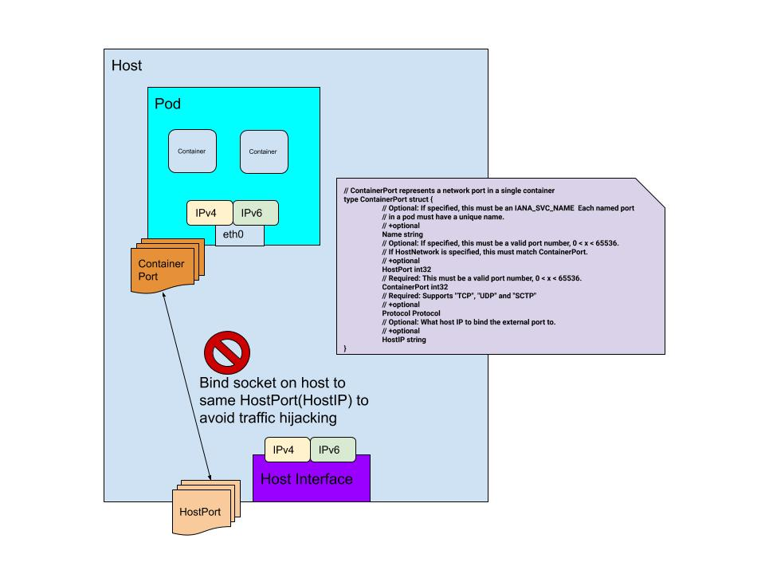

<!-- markdownlint-disable-next-line MD041 -->

# Host Port Manager

The Host Port Managers maps ports from the Host to the specified Container Port.
It can also specify the Host IP that should be mapped to the container IP.
For security reasons, it also opens a socket in the host to avoid any
process in the system that could interfere with the traffic that is being port mapped.

This code is copied from the [kubernetes/kubernetes repo](https://github.com/kubernetes/kubernetes/tree/41533ecec8966636554faba44368a36d5d6c5347/pkg/kubelet/dockershim/network/hostport.)
Since Kubernetes started the deprecation of that part of the code in
[#94624](https://github.com/kubernetes/kubernetes/pull/94624), it is missing some
fixes and the features required to operate correctly in dual stack environments.

The kubernetes/kubernetes repo has a fix where the host port manager always opens
a socket in all addresses, instead of leveraging the HostIP field:
[#94382](https://github.com/kubernetes/kubernetes/pull/94382)

The current implementation only maps ports for the first IP of each IP family
obtained from the CNI results.
