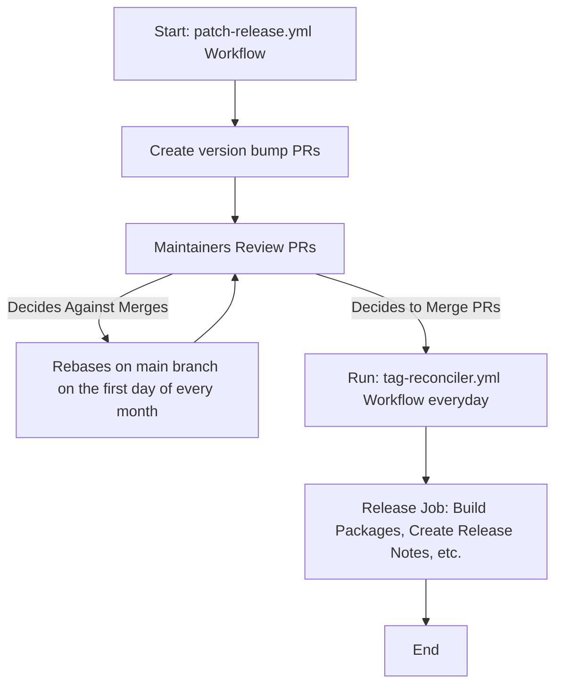
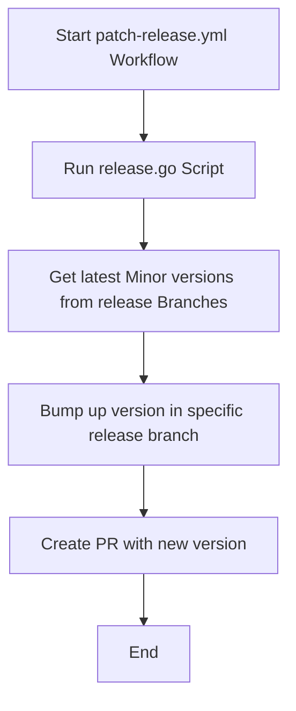
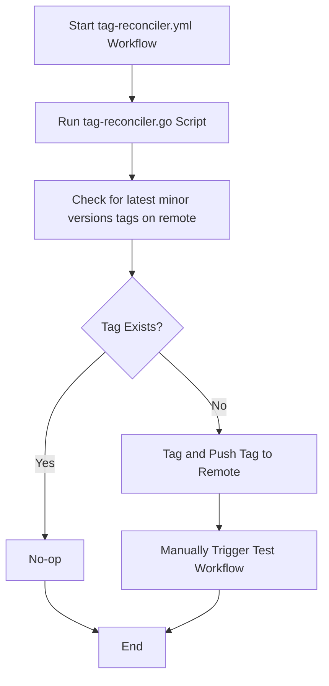

# CRI-O Automated Patch Releases

Automated Patch Releases provide an easy way of packaging and releasing a new version
of CRI-O. This involves the use of Golang scripts and Github Actions and follows
the outlined flow:

## Patch Release

The
[patch-release.yml](https://github.com/cri-o/cri-o/actions/workflows/patch-release.yml)
Workflow runs the golang script
[release.go](https://github.com/cri-o/cri-o/blob/main/scripts/release/release.go)

## Pushing New Version tags

To push the new version tags and cut the release, the
[tag-reconciler.yml](https://github.com/cri-o/cri-o/actions/workflows/tag-reconciler.yml)
Workflow runs the golang script
[tag-reconciler.go](https://github.com/cri-o/cri-o/blob/main/scripts/tag-reconciler/tag-reconciler.go)

This will inturn run the
[test.yml](https://github.com/cri-o/cri-o/actions/workflows/test.yml)
which will build and package the latest versions for CRI-O

