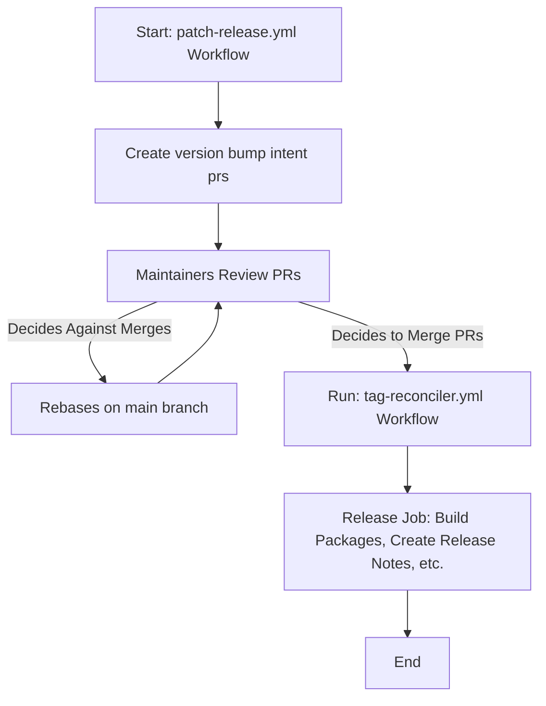
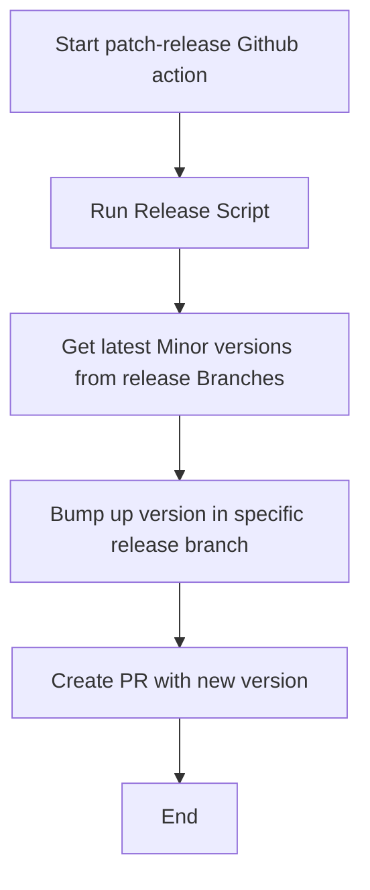
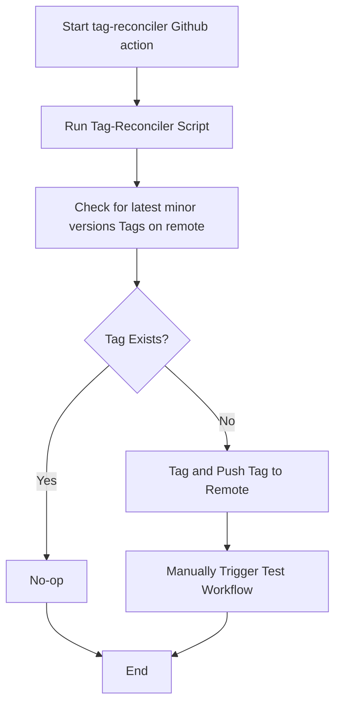

# CRI-O Automated Patch Releases

Automated Patch Releases provide an easy way of packaging and releasing a new version
of CRI-O
This involves the use of Golang Scripts and Github Actions

## Patch Release

The `.github/workflows/patch-release.yml` runs the golang script
`scripts/tag-reconciler/tag-reconciler.go`

## Pushing New Version tags

To push the new version tags and cut the release, the
`.github/workflows/tag-reconciler.yml` runs the golang script
`scripts/tag-reconciler/tag-reconciler.go`

This will inturn run the `.github/workflows/test.yml` which will build and
package the latest versions for CRI-O

