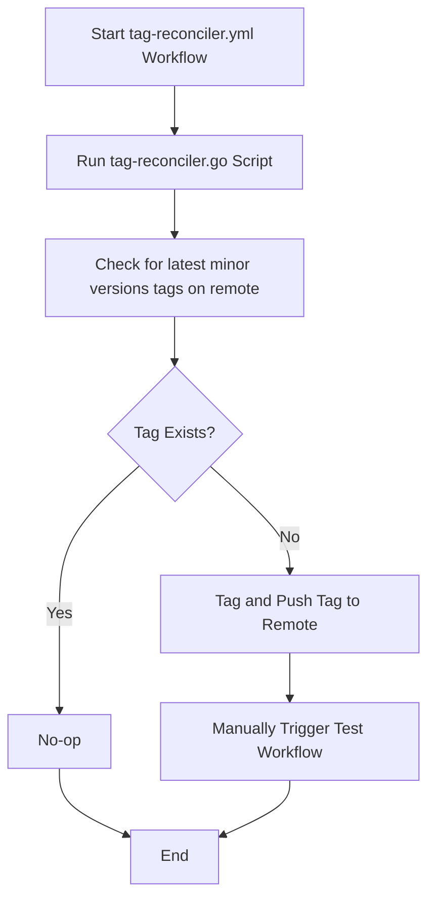
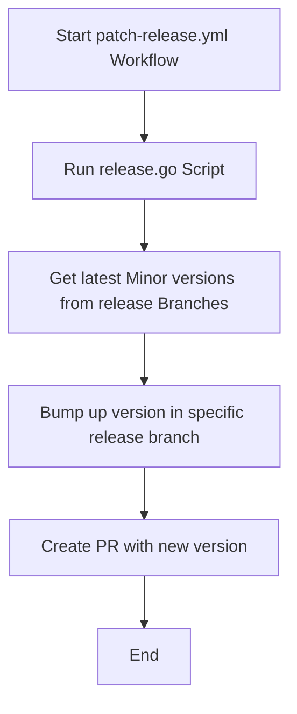
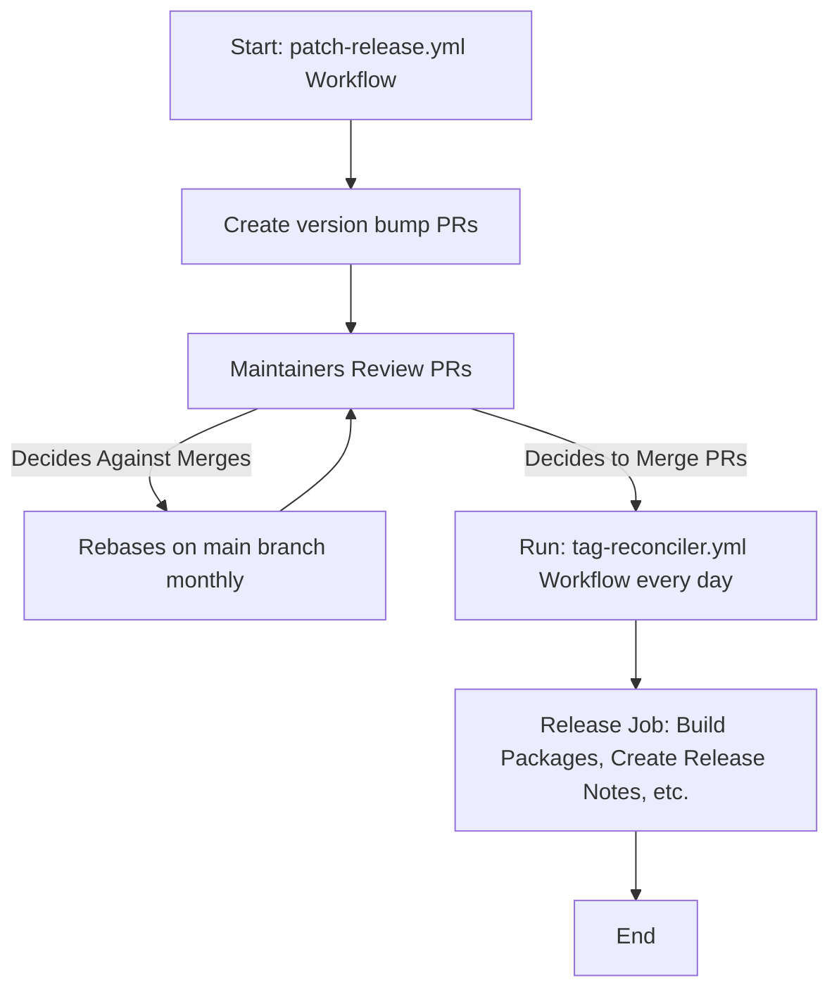

# CRI-O CI Architecture

CRI-O's CI builds static binaries, manages versions and tags, and creates
GitHub releases. The
[`cri-o/packaging`](https://github.com/cri-o/packaging) repository consumes
these artifacts to produce RPM/DEB packages via the openSUSE Build Service
(OBS). For packaging pipeline details, see the
[packaging CI documentation](https://github.com/cri-o/packaging/blob/main/docs/ci.md).

## Static Binary Builds

The
[`test.yml`](https://github.com/cri-o/cri-o/blob/main/.github/workflows/test.yml)
workflow builds statically linked `crio` and `pinns` binaries using
[Nix](https://nixos.org) for four architectures: `amd64`, `arm64`, `ppc64le`,
and `s390x`. The build configuration lives in
[`flake.nix`](../flake.nix) and
[`nix/derivation.nix`](../nix/derivation.nix).

On push to `main`, `release-*` branches, or tags, the `static-build-upload` job
uploads the binaries to GCS:

```text
gs://cri-o/artifacts/<commit>/<arch>/crio
gs://cri-o/artifacts/<commit>/<arch>/pinns
```

## Version Markers

The
[`scripts/upload-artifacts`](upload-artifacts)
script writes plain-text marker files to the GCS bucket root after each
successful build. These files contain the commit SHA or tag name that was last
built:

| Marker file                                                               | Written when          | Content    |
| ------------------------------------------------------------------------- | --------------------- | ---------- |
| [`latest-main.txt`](https://storage.googleapis.com/cri-o/latest-main.txt) | Push to `main`        | Commit SHA |
| `latest-release-1.y.txt`                                                  | Push to `release-1.y` | Commit SHA |
| `latest-1.y.txt`                                                          | Tag `v1.y.z` pushed   | Tag name   |

The packaging repository reads these markers to discover the latest available
binaries.

## OpenVEX Reports

The `vex-upload` job in `test.yml` uploads an
[OpenVEX](https://openvex.dev) vulnerability report (generated by `govulncheck`
in an earlier job) to GCS:

```text
gs://cri-o/artifacts/<commit>/cri-o.openvex.json
```

The packaging repository downloads this report (best-effort) and attaches it to
the published OCI artifacts.

## Version Management

Two variables in
[`internal/version/version.go`](../internal/version/version.go)
drive all release automation:

- `Version` (a `const`): The development version on `main`, always set to the
  next unreleased minor. If the latest stable release branch is `release-1.y`,
  then `Version` is `1.(y+1).0`.
- `ReleaseMinorVersions` (a `var`): The currently supported release branches
  (up to 4 minor versions). The tag reconciler, patch release, and
  reconciliation scripts all iterate over this list.

These values are kept in sync with
[`dependencies.yaml`](../dependencies.yaml)
and
[`contrib/test/ci/cri-o.spec`](../contrib/test/ci/cri-o.spec)
via [zeitgeist](https://github.com/kubernetes-sigs/zeitgeist) (checked in CI by
`make verify-dependencies`).

## Tag Reconciler

The
[`tag-reconciler.yml`](../.github/workflows/tag-reconciler.yml)
workflow runs daily at midnight UTC. For each minor version in
`ReleaseMinorVersions`, it runs
[`scripts/tag-reconciler/tag-reconciler.go`](tag-reconciler/tag-reconciler.go),
which:

1. Reads the `Version` constant from the corresponding `release-1.y` branch.
2. Checks whether a tag `v1.y.z` already exists.
3. If not, creates the tag and triggers the test workflow for it.

This is how `.0` releases (and subsequent patch releases) get tagged
automatically.



## Patch Releases

The
[`patch-release.yml`](../.github/workflows/patch-release.yml)
workflow runs monthly on the 1st. For each minor version in
`ReleaseMinorVersions`, it runs
[`scripts/release/release.go`](release/release.go),
which:

1. Checks out the `release-1.y` branch.
2. Bumps the patch version (e.g. `1.y.1` to `1.y.2`).
3. Updates `version.go`, `dependencies.yaml`, and `cri-o.spec`.
4. Creates a pull request against the release branch.

Once the PR merges, the tag reconciler picks up the new version and tags it.



## Release Branch Forward

The
[`release-branch-forward.yml`](../.github/workflows/release-branch-forward.yml)
workflow runs daily. It runs
[`scripts/release-branch-forward/release_branch_forward.go`](release-branch-forward/release_branch_forward.go),
which finds the latest release branch (by version sort) and merges `main` into
it, but only if no tags exist on that branch yet. This keeps the latest release
branch in sync with `main` until the first tag is created.

## GitHub Releases

When a tag is pushed, the `create-release` job in `test.yml` creates a GitHub
Release. The release notes are generated by
[`scripts/release-notes`](release-notes)
and include download links for all bundle artifacts, SBOMs, signatures,
provenance, and cosign verification commands that reference the packaging
repository's workflow identity.

## End-to-End Flow

The following diagram shows how the patch release and tag reconciler workflows
interact:


