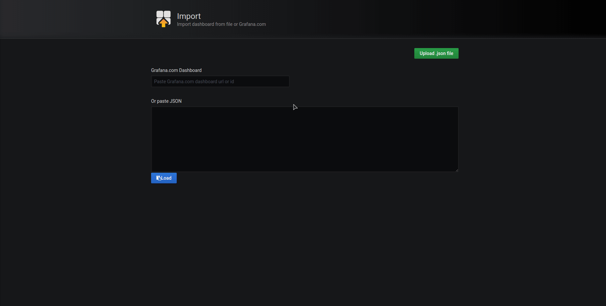

# CRI-O Metrics

To enable the [Prometheus][0] metrics exporter for CRI-O, either start `crio`
with `--metrics-enable` or add the corresponding option to a config overwrite,
for example `/etc/crio/crio.conf.d/01-metrics.conf`:

```toml
[crio.metrics]
enable_metrics = true
```

The metrics endpoint serves per default on port `9090` via HTTP. This can be
changed via the `--metrics-port` command line argument or via the configuration
file:

```toml
metrics_port = 9090
```

If CRI-O runs with enabled metrics, then this can be verified by querying the
endpoint manually via [curl][1].

```shell
curl localhost:9090/metrics
```

It is also possible to serve the metrics via HTTPs, by providing an additional
certificate and key:

```toml
[crio.metrics]
enable_metrics = true
metrics_cert = "/path/to/cert.pem"
metrics_key = "/path/to/key.pem"
```

## Available Metrics

Beside the [default golang based metrics][2], CRI-O provides
the following additional metrics:

<!-- markdownlint-disable MD013 MD033 -->
| Metric Key                                       | Possible Labels or Buckets                                                                                                                                      | Type      | Purpose                                                                                                                                                           |
| ------------------------------------------------ | --------------------------------------------------------------------------------------------------------------------------------------------------------------- | --------- | ----------------------------------------------------------------------------------------------------------------------------------------------------------------- |
| `crio_operations_total`                          | every CRI-O RPC\* `operation`                                                                                                                                   | Counter   | Cumulative number of CRI-O operations by operation type.                                                                                                          |
| `crio_operations_latency_seconds_total`          | every CRI-O RPC\* `operation`,<br><br>`network_setup_pod` (CNI pod network setup time),<br><br>`network_setup_overall` (Overall network setup time)             | Summary   | Latency in seconds of CRI-O operations. Split-up by operation type.                                                                                               |
| `crio_operations_latency_seconds`                | every CRI-O RPC\* `operation`                                                                                                                                   | Gauge     | Latency in seconds of individual CRI calls for CRI-O operations. Broken down by operation type.                                                                   |
| `crio_operations_errors_total`                   | every CRI-O RPC\* `operation`                                                                                                                                   | Counter   | Cumulative number of CRI-O operation errors by operation type.                                                                                                    |
| `crio_image_pulls_bytes_total`                   | `mediatype`, `size`<br>sizes are in bucket of bytes for layer sizes of 1 KiB, 1 MiB, 10 MiB, 50 MiB, 100 MiB, 200 MiB, 300 MiB, 400 MiB, 500 MiB, 1 GiB, 10 GiB | Counter   | Bytes transferred by CRI-O image pulls.                                                                                                                           |
| `crio_image_pulls_skipped_bytes_total`           | `size`<br>sizes are in bucket of bytes for layer sizes of 1 KiB, 1 MiB, 10 MiB, 50 MiB, 100 MiB, 200 MiB, 300 MiB, 400 MiB, 500 MiB, 1 GiB, 10 GiB              | Counter   | Bytes skipped by CRI-O image pulls by name. The ratio of skipped bytes to total bytes can be used to determine cache reuse ratio.                                 |
| `crio_image_pulls_success_total`                 |                                                                                                                                                                 | Counter   | Successful image pulls.                                                                                                                                           |
| `crio_image_pulls_failure_total`                 | `error`                                                                                                                                                         | Counter   | Failed image pulls by their error category.                                                                                                                       |
| `crio_image_pulls_layer_size_{sum,count,bucket}` | buckets in byte for layer sizes of 1 KiB, 1 MiB, 10 MiB, 50 MiB, 100 MiB, 200 MiB, 300 MiB, 400 MiB, 500 MiB, 1 GiB, 10 GiB                                     | Histogram | Bytes transferred by CRI-O image pulls per layer.                                                                                                                 |
| `crio_image_layer_reuse_total`                   |                                                                                                                                                                 | Counter   | Reused (not pulled) local image layer count by name.                                                                                                              |
| `crio_containers_dropped_events_total`           |                                                                                                                                                                 | Counter   | The total number of container events dropped.                                                                                                                     |
| `crio_containers_oom_total`                      |                                                                                                                                                                 | Counter   | Total number of containers killed because they ran out of memory (OOM).                                                                                           |
| `crio_containers_oom_count_total`                | `name`                                                                                                                                                          | Counter   | Containers killed because they ran out of memory (OOM) by their name.<br>The label `name` can have high cardinality sometimes but it is in the interest of users giving them the ease to identify which container(s) are going into OOM state. Also, ideally very few containers should OOM keeping the label cardinality of `name` reasonably low. |
| `crio_containers_seccomp_notifier_count_total`   | `name`, `syscall`                                                                                                                                               | Counter   | Forbidden `syscall` count resulting in killed containers by `name`.                                                                                               |
| `crio_processes_defunct`                         |                                                                                                                                                                 | Gauge     | Total number of defunct processes in the node                                                                                                                     |
<!-- markdownlint-enable MD013 MD033 -->

- Available CRI-O RPC's from the [gRPC API][3]: `Attach`, `ContainerStats`, `ContainerStatus`,
  `CreateContainer`, `Exec`, `ExecSync`, `ImageFsInfo`, `ImageStatus`,
  `ListContainerStats`, `ListContainers`, `ListImages`, `ListPodSandbox`,
  `PodSandboxStatus`, `PortForward`, `PullImage`, `RemoveContainer`,
  `RemoveImage`, `RemovePodSandbox`, `ReopenContainerLog`, `RunPodSandbox`,
  `StartContainer`, `Status`, `StopContainer`, `StopPodSandbox`,
  `UpdateContainerResources`, `UpdateRuntimeConfig`, `Version`

- Available error categories for `crio_image_pulls_failures`:
  - `UNKNOWN`: The default label which gets applied if the error is not known
  - `CONNECTION_REFUSED`: The local network is down or the registry refused the
    connection.
  - `CONNECTION_TIMEOUT`: The connection timed out during the image download.
  - `NOT_FOUND`: The registry does not exist at the specified resource
  - `BLOB_UNKNOWN`: This error may be returned when a blob is unknown to the
    registry in a specified repository. This can be returned with a standard get
    or if a manifest references an unknown layer during upload.
  - `BLOB_UPLOAD_INVALID`: The blob upload encountered an error and can no
    longer proceed.
  - `BLOB_UPLOAD_UNKNOWN`: If a blob upload has been cancelled or was never
    started, this error code may be returned.
  - `DENIED`: The access controller denied access for the operation on a
    resource.
  - `DIGEST_INVALID`: When a blob is uploaded, the registry will check that the
    content matches the digest provided by the client. The error may include a
    detail structure with the key "digest", including the invalid digest string.
    This error may also be returned when a manifest includes an invalid layer
    digest.
  - `MANIFEST_BLOB_UNKNOWN`: This error may be returned when a manifest blob is
    unknown to the registry.
  - `MANIFEST_INVALID`: During upload, manifests undergo several checks ensuring
    validity. If those checks fail, this error may be returned, unless a more
    specific error is included. The detail will contain information the failed
    validation.
  - `MANIFEST_UNKNOWN`: This error is returned when the manifest, identified by
    name and tag is unknown to the repository.
  - `MANIFEST_UNVERIFIED`: During manifest upload, if the manifest fails
    signature verification, this error will be returned.
  - `NAME_INVALID`: Invalid repository name encountered either during manifest.
    validation or any API operation.
  - `NAME_UNKNOWN`: This is returned if the name used during an operation is
    unknown to the registry.
  - `SIZE_INVALID`: When a layer is uploaded, the provided size will be checked
    against the uploaded content. If they do not match, this error will be
    returned.
  - `TAG_INVALID`: During a manifest upload, if the tag in the manifest does not
    match the uri tag, this error will be returned.
  - `TOOMANYREQUESTS`: Returned when a client attempts to contact a service too
    many times.
  - `UNAUTHORIZED`: The access controller was unable to authenticate the client.
    Often this will be accompanied by a Www-Authenticate HTTP response header
    indicating how to authenticate.
  - `UNAVAILABLE`: Returned when a service is not available.
  - `UNSUPPORTED`: The operation was unsupported due to a missing implementation
    or invalid set of parameters.

[0]: https://prometheus.io
[1]: https://github.com/curl/curl
[2]: https://github.com/prometheus/client_golang/blob/b8b56b52bdb3a79ab877c873463cadc841133360/prometheus/go_collector.go#L65-L281
[3]: https://github.com/kubernetes/cri-api/blob/a6f63f369f6d50e9d0886f2eda63d585fbd1ab6a/pkg/apis/runtime/v1alpha2/api.proto#L34-L128

## Exporting Metrics via Prometheus

The CRI-O metrics exporter can be used to provide a cluster wide scraping
endpoint for Prometheus. It is possible to either build the container image
manually via `make metrics-exporter` or directly consume the [available image on
quay.io][4].

[4]: https://quay.io/repository/crio/metrics-exporter

The deployment requires enabled [RBAC][5] within the target Kubernetes
environment and creates a new [ClusterRole][6] to be able to list available
nodes. Beside that a new Role will be created to be able to update a config-map
within the `cri-o-exporter` namespace. Please be aware that the exporter only
works if the pod has access to the node IP from its namespace. This should
generally work but might be restricted due to network configuration or policies.

[5]: https://kubernetes.io/docs/reference/access-authn-authz/rbac
[6]: https://kubernetes.io/docs/reference/generated/kubernetes-api/v1.18/#clusterrole-v1-rbac-authorization-k8s-io

To deploy the metrics exporter within a new `cri-o-metrics-exporter` namespace,
simply apply the [cluster.yaml][7] from the root directory of this repository:

[7]: ../contrib/metrics-exporter/cluster.yaml

```shell
kubectl create -f contrib/metrics-exporter/cluster.yaml
```

The `CRIO_METRICS_PORT` environment variable is set per default to `"9090"` and
can be used to customize the metrics port for the nodes. If the deployment is
up and running, it should log the registered nodes as well as that a new
config-map has been created:

```shell
$ kubectl logs -f cri-o-metrics-exporter-65c9b7b867-7qmsb
level=info msg="Getting cluster configuration"
level=info msg="Creating Kubernetes client"
level=info msg="Retrieving nodes"
level=info msg="Registering handler /master (for 172.1.2.0)"
level=info msg="Registering handler /node-0 (for 172.1.3.0)"
level=info msg="Registering handler /node-1 (for 172.1.3.1)"
level=info msg="Registering handler /node-2 (for 172.1.3.2)"
level=info msg="Registering handler /node-3 (for 172.1.3.3)"
level=info msg="Registering handler /node-4 (for 172.1.3.4)"
level=info msg="Updated scrape configs in configMap cri-o-metrics-exporter"
level=info msg="Wrote scrape configs to configMap cri-o-metrics-exporter"
level=info msg="Serving HTTP on :8080"
```

The config-map now contains the [scrape configuration][8], which can be used for
Prometheus:

[8]: https://prometheus.io/docs/prometheus/latest/configuration/configuration/#scrape_config

```shell
kubectl get cm cri-o-metrics-exporter -o yaml
```

```yaml
apiVersion: v1
data:
  config: |
    scrape_configs:
    - job_name: "cri-o-exporter-master"
      scrape_interval: 1s
      metrics_path: /master
      static_configs:
        - targets: ["cri-o-metrics-exporter.cri-o-metrics-exporter"]
          labels:
            instance: "master"
    - job_name: "cri-o-exporter-node-0"
      scrape_interval: 1s
      metrics_path: /node-0
      static_configs:
        - targets: ["cri-o-metrics-exporter.cri-o-metrics-exporter"]
          labels:
            instance: "node-0"
    - job_name: "cri-o-exporter-node-1"
      scrape_interval: 1s
      metrics_path: /node-1
      static_configs:
        - targets: ["cri-o-metrics-exporter.cri-o-metrics-exporter"]
          labels:
            instance: "node-1"
    - job_name: "cri-o-exporter-node-2"
      scrape_interval: 1s
      metrics_path: /node-2
      static_configs:
        - targets: ["cri-o-metrics-exporter.cri-o-metrics-exporter"]
          labels:
            instance: "node-2"
    - job_name: "cri-o-exporter-node-3"
      scrape_interval: 1s
      metrics_path: /node-3
      static_configs:
        - targets: ["cri-o-metrics-exporter.cri-o-metrics-exporter"]
          labels:
            instance: "node-3"
    - job_name: "cri-o-exporter-node-4"
      scrape_interval: 1s
      metrics_path: /node-4
      static_configs:
        - targets: ["cri-o-metrics-exporter.cri-o-metrics-exporter"]
          labels:
            instance: "node-4"
kind: ConfigMap
metadata:
  creationTimestamp: "2020-05-12T08:29:06Z"
  name: cri-o-metrics-exporter
  namespace: cri-o-metrics-exporter
  resourceVersion: "2862950"
  selfLink: /api/v1/namespaces/cri-o-metrics-exporter/configmaps/cri-o-metrics-exporter
  uid: 1409804a-78a2-4961-8205-c5f383626b4b
```

If the scrape configuration has been added to the Prometheus server, then the
provided [Grafana][9] dashboard [within this repository][10] can be setup, too:

[9]: https://grafana.com
[10]: ../contrib/metrics-exporter/dashboard.json


