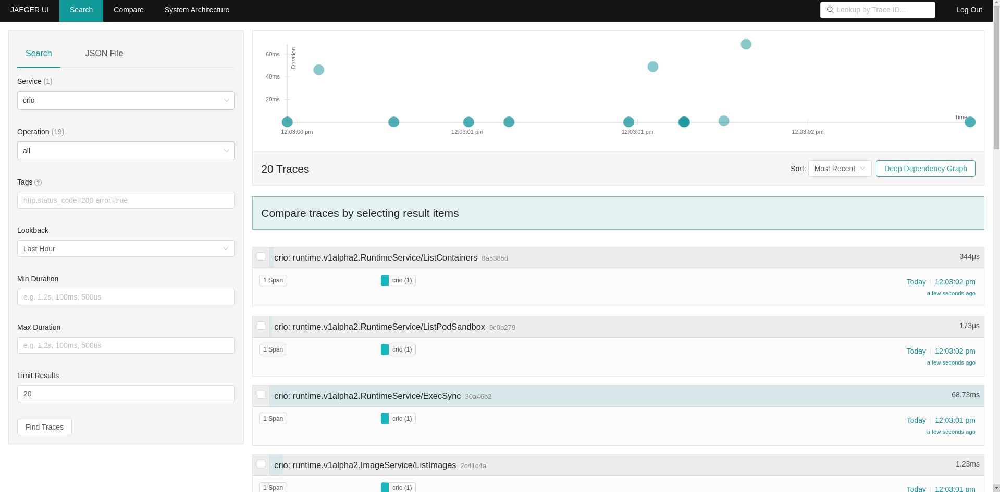

# Capture `cri-o` traces using OpenTelemetry

## Install OpenTelemetry

```sh
oc create ns otel
oc project otel
oc create sa otel && oc adm policy add-role-to-user admin -z otel && oc adm policy add-cluster-role-to-user cluster-admin -z otel
```

Create otel-agent and otel-collector YAML objects from stdin

```sh
cat <<EOF | kubectl apply -f -
apiVersion: v1
kind: ConfigMap
metadata:
  name: otel-agent-conf
  labels:
    app: opentelemetry
    component: otel-agent-conf
data:
  otel-agent-config: |
    receivers:
      otlp:
        protocols:
          grpc:
            max_recv_msg_size_mib: 999999999
          http:
    exporters:
      logging:
      otlp:
        endpoint: "ClusterIP:4317" # replace with the ClusterIP for otel-collector service
        insecure: true
    processors:
      batch:
    extensions:
      health_check: {}
    service:
      extensions: [health_check]
      pipelines:
        traces:
          receivers: [otlp]
          processors: [batch]
          exporters: [logging, otlp]
---
apiVersion: apps/v1
kind: DaemonSet
metadata:
  name: otel-agent
  labels:
    app: opentelemetry
    component: otel-agent
spec:
  selector:
    matchLabels:
      app: opentelemetry
      component: otel-agent
  template:
    metadata:
      labels:
        app: opentelemetry
        component: otel-agent
    spec:
      securityContext: {}
      serviceAccount: otel
      serviceAccountName: otel
      hostNetwork: true
      containers:
      - command:
          - "/otelcol"
          - "--config=/conf/otel-agent-config.yaml"
          # Memory Ballast size should be max 1/3 to 1/2 of memory.
          - "--mem-ballast-size-mib=165"
        image: otel/opentelemetry-collector-dev:latest
        name: otel-agent
        resources:
          limits:
            cpu: "1"
            memory: 1Gi
          requests:
            cpu: 500m
            memory: 500Mi
        ports:
        - containerPort: 4317 # Default OpenTelemetry receiver port.
        - containerPort: 8888  # Metrics.
        volumeMounts:
        - name: otel-agent-config-vol
          mountPath: /conf
        livenessProbe:
          httpGet:
            path: /
            port: 13133 # Health Check extension default port.
        readinessProbe:
          httpGet:
            path: /
            port: 13133 # Health Check extension default port.
      volumes:
        - configMap:
            name: otel-agent-conf
            items:
              - key: otel-agent-config
                path: otel-agent-config.yaml
          name: otel-agent-config-vol
---
apiVersion: v1
kind: ConfigMap
metadata:
  name: otel-collector-conf
  labels:
    app: opentelemetry
    component: otel-collector-conf
data:
  otel-collector-config: |
    receivers:
      otlp:
        protocols:
          grpc:
            max_recv_msg_size_mib: 999999999
    processors:
      batch:
    extensions:
      health_check: {}
    exporters:
      logging:
      zipkin:
        endpoint: "http://somezipkin.target.com:9411/api/v2/spans" # Replace with a real endpoint.
      jaeger:
        endpoint: "jaeger-collector.otel.svc.cluster.local:14250" # Replace with a real endpoint.
        insecure: true
    service:
      extensions: [health_check]
      pipelines:
        traces/1:
          receivers: [otlp]
          processors: [batch]
          exporters: [logging, jaeger]
---
apiVersion: v1
kind: Service
metadata:
  name: otel-collector
  labels:
    app: opentelemetry
    component: otel-collector
spec:
  ports:
  - name: otlp # Default endpoint for OpenTelemetry receiver.
    port: 4317
    protocol: TCP
    targetPort: 4317
  - name: jaeger-https # Default endpoint for Jaeger gRPC receiver
    port: 14250
    targetPort: 14250
  - name: jaeger-thrift-http # Default endpoint for Jaeger HTTP receiver.
    port: 14268
  - name: zipkin # Default endpoint for Zipkin receiver.
    port: 9411
  - name: metrics # Default endpoint for querying metrics.
    port: 8888
  selector:
    component: otel-collector
---
apiVersion: apps/v1
kind: Deployment
metadata:
  name: otel-collector
  labels:
    app: opentelemetry
    component: otel-collector
spec:
  selector:
    matchLabels:
      app: opentelemetry
      component: otel-collector
  minReadySeconds: 5
  progressDeadlineSeconds: 120
  replicas: 1 #TODO - adjust this to your own requirements
  template:
    metadata:
      labels:
        app: opentelemetry
        component: otel-collector
    spec:
      containers:
      - command:
          - "/otelcol"
          - "--config=/conf/otel-collector-config.yaml"
#           Memory Ballast size should be max 1/3 to 1/2 of memory.
          - "--mem-ballast-size-mib=683"
        image: otel/opentelemetry-collector-dev:latest
        name: otel-collector
        resources:
          limits:
            cpu: 1
            memory: 2Gi
          requests:
            cpu: 500m
            memory: 1Gi
        ports:
        - containerPort: 55679 # Default endpoint for ZPages.
        - containerPort: 4317 # Default endpoint for OpenTelemetry receiver.
        - containerPort: 14250 # Default endpoint for Jaeger HTTP receiver.
        - containerPort: 14268 # Default endpoint for Jaeger HTTP receiver.
        - containerPort: 9411 # Default endpoint for Zipkin receiver.
        - containerPort: 8888  # Default endpoint for querying metrics.
        env:
        - name: JAEGER_AGENT_HOST
          valueFrom:
            fieldRef:
              fieldPath: status.hostIP
        volumeMounts:
        - name: otel-collector-config-vol
          mountPath: /conf
        livenessProbe:
          httpGet:
            path: /
            port: 13133 # Health Check extension default port.
        readinessProbe:
          httpGet:
            path: /
            port: 13133 # Health Check extension default port.
      volumes:
        - configMap:
            name: otel-collector-conf
            items:
              - key: otel-collector-config
                path: otel-collector-config.yaml
          name: otel-collector-config-vol
EOF
```
This will create 2 configmaps `otel-agent-conf` and `otel-collector-conf`. `otel-agent` is created as a `DaemonSet` and `otel-collector` is created as a `Deployment`

```sh
watch oc get configmaps, ds, deployment, services
```

Once the service is up and running take the `ClusterIp` and update the otlp exporter endpoint in the configmap as

```sh
oc get svc -l component=otel-collector

NAME             TYPE        CLUSTER-IP      EXTERNAL-IP   PORT(S)                                          AGE
otel-collector   ClusterIP   172.30.240.70   <none>        4317/TCP,14250/TCP,14268/TCP,9411/TCP,8888/TCP   136m


 oc edit cm/otel-agent-conf -o yaml

 exporters:
      logging:
      otlp:
        endpoint: "ClusterIP:4317" # replace with the ClusterIP for otel-collector service from above 

```
Now delete the three agent pods so that the otel-agent DaemonSet can launch new pods with updated endpoint. 

```sh
oc delete pods --selector=component=otel-agent
```

Check otel-collector pod logs to see traces. You should see traces like

```sh
oc logs --selector=component=otel-collector

2021-06-15T13:38:56.990Z        INFO    loggingexporter/logging_exporter.go:42  TracesExporter  {"#spans": 110}
2021-06-15T13:38:58.995Z        INFO    loggingexporter/logging_exporter.go:42  TracesExporter  {"#spans": 23}
2021-06-15T13:39:02.001Z        INFO    loggingexporter/logging_exporter.go:42  TracesExporter  {"#spans": 55}
2021-06-15T13:39:04.005Z        INFO    loggingexporter/logging_exporter.go:42  TracesExporter  {"#spans": 77}
```

Since `Jaeger` is not running right now, you will also notice the below error in the collector log, but that will be resolved as soon as you install and create Jaeger. 

```
Exporting failed. Will retry the request after interval.        {"kind": "exporter", "name": "jaeger", "error": "failed to push trace data via Jaeger exporter: rpc error: code = Unavailable desc = connection error: desc = \"transport: Error while dialing dial tcp: lookup jaeger-collector.otel.svc.cluster.local on 172.30.0.10:53: no such host\"", "interval": "5.934115365s"}
```

## Steps to install Jaeger

```ssh
oc login -u <privileged user>
oc new-project observability
oc project observability

oc create -f https://raw.githubusercontent.com/jaegertracing/jaeger-operator/master/deploy/crds/jaegertracing.io_jaegers_crd.yaml
oc create -n observability -f https://raw.githubusercontent.com/jaegertracing/jaeger-operator/master/deploy/service_account.yaml
oc create -n observability -f https://raw.githubusercontent.com/jaegertracing/jaeger-operator/master/deploy/role.yaml
oc create -n observability -f https://raw.githubusercontent.com/jaegertracing/jaeger-operator/master/deploy/role_binding.yaml
oc create -n observability -f https://raw.githubusercontent.com/jaegertracing/jaeger-operator/master/deploy/operator.yaml
```

Now that the operator is installed, edit the operator deployment to observe namespaces other than the namespace `observability` where the operator is running.

```sh
apiVersion: apps/v1
kind: Deployment
metadata:
  name: jaeger-operator
spec:
  replicas: 1
  selector:
    matchLabels:
      name: jaeger-operator
  template:
    metadata:
      labels:
        name: jaeger-operator
    spec:
      serviceAccountName: jaeger-operator
      containers:
      - name: jaeger-operator
        image: jaegertracing/jaeger-operator:1.23.0
        ports:
        - containerPort: 8383
          name: http-metrics
        - containerPort: 8686
          name: cr-metrics
        args: ["start"]
        imagePullPolicy: Always
        env:
        - name: WATCH_NAMESPACE   # Change the value of  WATCH_NAMESPACE env variable to ""
          valueFrom:
            fieldRef:
              fieldPath: metadata.namespace
        - name: POD_NAME
          valueFrom:
            fieldRef:
              fieldPath: metadata.name
        - name: POD_NAMESPACE
          valueFrom:
            fieldRef:
              fieldPath: metadata.namespace
        - name: OPERATOR_NAME
          value: "jaeger-operator"
```


```sh
oc get deployment -n observability

NAME              READY   UP-TO-DATE   AVAILABLE   AGE
jaeger-operator   1/1     1            1           7m40s


oc edit deployments/jaeger-operator -n observability

  ...
  spec:
      containers:
      - args:
        - start
        env:
        - name: WATCH_NAMESPACE
          value: ""

```

The simplest possible way to create a Jaeger instance is by creating a YAML file like the following example. This will install the default AllInOne strategy, which deploys the “all-in-one” image (agent, collector, query, ingester, Jaeger UI) in a single pod, using in-memory storage by default.

```sh
oc project otel

cat <<EOF | kubectl apply -f -
apiVersion: jaegertracing.io/v1
kind: Jaeger
metadata:
  name: jaeger
EOF
```

Edit the deployment/jaeger to disable tls in `.spec.spec.containers.args` as below. (These values are true by default)

```sh
oc edit deployment/jaeger -n otel


...
spec:
      containers:
      - args:
        - --collector.grpc.tls.enabled=false
        - --reporter.grpc.tls.enabled=false

```

(These values are true by default). Check if Jaeger instance is up and running

```sh
oc get pods -l app.kubernetes.io/instance=jaeger -n otel

NAME                        READY     STATUS    RESTARTS   AGE
jaeger-6499bb6cdd-kqx75     1/1       Running   0          2m
```

The `otel-collector` configmap needs to be updated with jaeger endpoint. To do so, first acquire the `jaeger-collector` ClusterIP

```sh

oc get svc -l app=jaeger -n otel

NAME                        TYPE        CLUSTER-IP       EXTERNAL-IP   PORT(S)                                  AGE
jaeger-agent                ClusterIP   None             <none>        5775/UDP,5778/TCP,6831/UDP,6832/UDP      19m
jaeger-collector            ClusterIP   172.30.120.153   <none>        9411/TCP,14250/TCP,14267/TCP,14268/TCP   19m
jaeger-collector-headless   ClusterIP   None             <none>        9411/TCP,14250/TCP,14267/TCP,14268/TCP   19m
jaeger-query                ClusterIP   172.30.249.54    <none>        443/TCP                                  19m
```

Note the Cluster-IP of `jaeger-collector`. This IP will be added to ote-collector-conf configmap

```sh
oc edit cm/otel-collector-conf -n otel
```

```
...
exporters:
      logging:
      zipkin:
        endpoint: "http://somezipkin.target.com:9411/api/v2/spans" # Replace with a real endpoint.
      jaeger:
        endpoint: "172.30.120.153:14250" # Replace with a real endpoint.

```

Delete otel-collector so that new collector pod is created with new endpoint. The new otel-collector pod will have logs indicating that connection to jaeger exporter has been established

```sh
oc delete pod --selector=component=otel-collector -n otel

oc  logs --selector=component=otel-collector -n otel

2021-06-17T16:02:07.918Z        info    builder/exporters_builder.go:92 Exporter is starting... {"kind": "exporter", "name": "jaeger"}
2021-06-17T16:02:07.918Z        info    jaegerexporter/exporter.go:186  State of the connection with the Jaeger Collector backend    {"kind": "exporter", "name": "jaeger", "state": "CONNECTING"}
2021-06-17T16:02:08.919Z        info    jaegerexporter/exporter.go:186  State of the connection with the Jaeger Collector backend    {"kind": "exporter", "name": "jaeger", "state": "READY"}
```

To watch the spans in Jaeger UI

```sh
oc get routes -n otel

NAME     HOST/PORT                                                                  PATH   SERVICES       PORT    TERMINATION   WILDCARD
jaeger   jaeger-otel.apps.ci-ln-lwx6n82-f76d1.origin-ci-int-gce.dev.openshift.com          jaeger-query   <all>   reencrypt     None

```

Access the above routes to see cri-o spans in Jaeger UI




