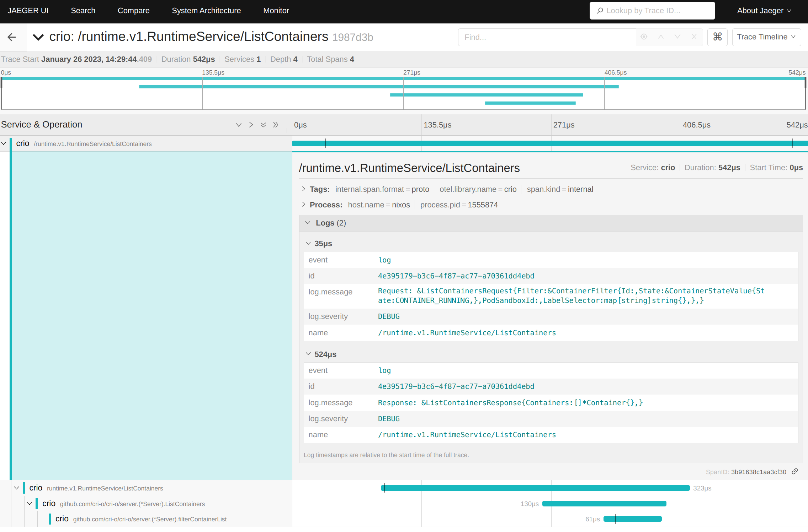

# CRI-O Tracing

## Configuration

To enable [OpenTelemetry][otel] tracing support in CRI-O, either start `crio`
with `--enable-tracing` or add the corresponding option to a config overwrite,
for example `/etc/crio/crio.conf.d/01-tracing.conf`:

[otel]: https://opentelemetry.io

```toml
[crio.tracing]
enable_tracing = true
```

Traces in CRI-O get exported via the [OpenTelemetry Protocol][otlp] by using an
[gRPC][grpc] endpoint. This endpoint defaults to `127.0.0.1:4317`, but can be
configured by using the `--tracing-endpoint` flag or the corresponding TOML
configuration:

[otlp]: https://github.com/open-telemetry/opentelemetry-specification/blob/main/specification/protocol/otlp.md
[grpc]: https://github.com/open-telemetry/opentelemetry-specification/blob/main/specification/protocol/otlp.md#otlpgrpc

```toml
[crio.tracing]
tracing_endpoint = "127.0.0.1:4317"
```

The final configuration aspect of OpenTelemetry tracing in CRI-O is the
`--tracing-sampling-rate-per-million` / `tracing_sampling_rate_per_million`
configuration, which refers to the amount of samples collected per million
spans. This means if it being set to `0` (the default), then CRI-O will not
collect any traces at all. If set to `1000000` (one million), then CRI-O will
create traces for all created spans. If the value is below one million, then
there is **no** way right now to select a subset of spans other than the modulo
of the set value.

[conmon-rs][conmon-rs] has the capability to add additional tracing past the
scope of CRI-O. This is automatically enabled when the `pod` runtime type is
chosen, like so:

```toml
[crio.runtime]
default_runtime = "runc"

[crio.runtime.runtimes.runc]
runtime_type = "pod"
```

[conmon-rs]: https://github.com/containers/conmon-rs

Then conmon-rs will export traces and spans in the same way CRI-O does
automatically. Both CRI-O and conmon-rs will correlate their logs to the traces
and spans. If the connection to the OTLP instance gets lost, then CRI-O will not
block, and all the traces during that time will be lost.

## Usage example

The [OpenTelemetry Collector][collector] alone cannot be used to visualize
traces and spans. For that a frontend like [Jaeger][jaeger] can be used to
visualize the data. The Jaeger community provides an all-in-one image which
already ships the collector as well:

[jaeger]: https://www.jaegertracing.io
[collector]: https://opentelemetry.io/docs/collector

```bash
podman run -it --rm --network host cr.jaegertracing.io/jaegertracing/jaeger:2.8.0
```

The Jaeger UI should be now available on `http://localhost:16686`.

It's now possible to start CRI-O with enabled tracing:

```bash
sudo crio --enable-tracing --tracing-sampling-rate-per-million 1000000
```

And when now running a CRI API call, for example by using[`crictl`](https://github.com/kubernetes-sigs/cri-tools):

```bash
sudo crictl ps
```

Then the visualization of the trace, its spans and log messages
can be now found in Jaeger via `http://localhost:16686`:



If kubelet tracing is enabled, then the spans are nested under the kubelet
traces. This is caused by the CRI calls from the kubelet, which propagates the
trace ID through the gRPC API.
